# BOOKNET - RESTFULL API

Este proyecto constituye la primera practica grupal de la asignatura Sistemas Orientados a Servicios (SOS)
de la facultad ETSIINF de la Universidad Politecnica de Madrid.
Este proyecto consiste en el desarrollo de un API de tipo REST para una red social llamada booknet,
esta red social es un punto de encuentro entre diferentes lectores, los cuales pueden compartir
los libros que han leido junto con una pequena resena, a su vez los usuarios pueden agregarse entre si
como amigos y poder ver la actividad reciente de los mismos.
<br><br><br><br>
<br><br><br><br>
<br><br><br><br>
<br><br><br><br>

## Informacion

| Informacion del proyecto: |  |   
| ----------- | --------
| Titulación  | Grado de Ingeniería Informática. Plan 09.
| Curso         | 2020/21
| Asignatura     | Sistemas Orientados a Servicios (SOS)
| Curso		 | 3º Curso
| Semestre    | 6º Semestre (Tarde)
| Proyecto    | Practica 1 - RESTFull API
| Nota        |  7,3
<br><br>

## Autores
- Jesus Vallejo Collados [150319]
- Francisco Javier Serrano Arrese [180487]
<br><br>
<br><br>

## Indice
- [BOOKNET - RESTFULL API](#booknet---restfull-api)
  * [Informacion](#informacion)
  * [Autores](#autores)
  * [Indice](#indice)
  * [Base de datos](#base-de-datos)
    + [Aspectos generales](#aspectos-generales)
    + [Esquema E/R](#esquema-e-r)
    + [Tabla USERS](#tabla-users)
    + [Tabla FRIENDSHIPS](#tabla-friendships)
    + [Tabla BOOKS](#tabla-books)
    + [Tabla READ BOOKS](#tabla-read-books)
    + [Script para crear la base de datos booknet](#script-para-crear-la-base-de-datos-booknet)
  * [Diseno de las URIs](#diseno-de-las-uris)
    + [USERS](#users)
    + [READ BOOKS](#read-books)
    + [FRIENDS](#friends)
  * [Testing de la API](#testing-de-la-api)
    + [Pruebas Postman](#pruebas-postman)
      - [USERS](#users-postman)
      - [READ BOOKS](#read-books-postman)
      - [FRIENDS](#friends-postman)
    + [Pruebas Cliente JAVA](#pruebas-cliente-java)
      - [USERS](#users-java)
      - [READ BOOKS](#read-books-java)
      - [FRIENDS](#friends-java)
<br><br><br><br>
<br><br><br><br>
<br><br><br><br>
<br><br><br><br><br><br><br>


## Base de datos

### Aspectos generales

Informacion de la base de datos en REST-VM:

- URI: `uri.booknet.com:3306`
- Nombre: `booknet`
- Usuario: `restuser`
- Contrasena: `restuser`

Tablas que conforman la base de datos:

- **USERS** (Tabla con los datos de los usuarios)
- **FRIENDSHIPS** (Tabla con las amistades entre usuarios)
- **BOOKS** (Tabla con la informacion de los libros)
- **READ_BOOKS** (Tabla con la informacion de las lecturas de los libros)
<br>
<br>

### Esquema E-R
Esquema de Entidad Relacion empleado en el diseno de la base de datos booknet:
<br><br>

<p align="center" width="1500">
  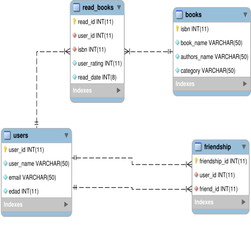
</p>
<br><br>

### Tabla USERS
Tabla con la informacion de los usuarios de booknet.

Cada usuario cuenta con los siguientes atributos:

| user_id | user_name | email | edad |
|:-:|:-:|:-:|:-:|
| INT | VARCHAR | VARCHAR | INT |

> **Primary Key:**
> user_id

<br>

### Tabla FRIENDSHIPS
Tabla con la informacion de las amistades entre los usuarios

Cada amistad cuenta con los siguientes atributos:

| friendship_id | user_id | friend_id |
|:-:|:-:|:-:|
| INT | INT | INT |
> **Primary Key:**
> friendship_id<br>
> **Foreign Key:**
> user_id<br>
> **Foreign Key:**
> friend_id

<br>

### Tabla BOOKS
Tabla con la informacion de los libros de la red booknet.

Cada libro cuenta con los siguientes atributos:

| isbn | book_name | authors_name | category |
|:-:|:-:|:-:|:-:|
| INT | VARCHAR | VARCHAR | VARCHAR |
> **Primary Key:**
> isbn

<br><br><br><br><br><br><br>

### Tabla READ BOOKS
Tabla con la informacion de una lectura de un libro realizada por un usuario

Cada lectura cuenta con los siguientes atributos:

| read_id | user_id | isbn | user_rating | read_date |
|:-:|:-:|:-:|:-:|:-:|
| INT | INT | INT | INT | INT |

> **Primary Key:**
> read_id<br>
> **Foreign Key:**
> user_id<br>
> **Foreign Key:**
> isbn

<br><br>

### Script para crear la base de datos booknet
> **Nota:**
> Este script es capaz de funcionar a pesar de que la base de datos haya sido creada anteriormente.

Script booknet_db:

``` MYSQL

CREATE DATABASE  IF NOT EXISTS `booknet` /*!40100 DEFAULT CHARACTER SET latin1 */;
USE `booknet`;
-- MySQL dump 10.13  Distrib 5.5.22, for debian-linux-gnu (i686)
--
-- Host: localhost    Database: booknet
-- ------------------------------------------------------
-- Server version	5.5.22-0ubuntu1

/*!40101 SET @OLD_CHARACTER_SET_CLIENT=@@CHARACTER_SET_CLIENT */;
/*!40101 SET @OLD_CHARACTER_SET_RESULTS=@@CHARACTER_SET_RESULTS */;
/*!40101 SET @OLD_COLLATION_CONNECTION=@@COLLATION_CONNECTION */;
/*!40101 SET NAMES utf8 */;
/*!40103 SET @OLD_TIME_ZONE=@@TIME_ZONE */;
/*!40103 SET TIME_ZONE='+00:00' */;
/*!40014 SET @OLD_UNIQUE_CHECKS=@@UNIQUE_CHECKS, UNIQUE_CHECKS=0 */;
/*!40014 SET @OLD_FOREIGN_KEY_CHECKS=@@FOREIGN_KEY_CHECKS, FOREIGN_KEY_CHECKS=0 */;
/*!40101 SET @OLD_SQL_MODE=@@SQL_MODE, SQL_MODE='NO_AUTO_VALUE_ON_ZERO' */;
/*!40111 SET @OLD_SQL_NOTES=@@SQL_NOTES, SQL_NOTES=0 */;

--
-- Table structure for table `books`
--

DROP TABLE IF EXISTS `books`;
/*!40101 SET @saved_cs_client     = @@character_set_client */;
/*!40101 SET character_set_client = utf8 */;
CREATE TABLE `books` (
  `isbn` int(11) NOT NULL AUTO_INCREMENT,
  `book_name` varchar(50) NOT NULL,
  `authors_name` varchar(50) NOT NULL,
  `category` varchar(50) NOT NULL,
  PRIMARY KEY (`isbn`)
) ENGINE=InnoDB AUTO_INCREMENT=6 DEFAULT CHARSET=latin1;
/*!40101 SET character_set_client = @saved_cs_client */;

--
-- Dumping data for table `books`
--

LOCK TABLES `books` WRITE;
/*!40000 ALTER TABLE `books` DISABLE KEYS */;
INSERT INTO `books` VALUES (1,'libro1','autor1','categoria1'),(2,'libro2','autor2','categoria1'),(3,'libro3','autor3','categoria1'),(4,'libro4','autor4','categoria2'),(5,'libro5','autor4','categoria3');
/*!40000 ALTER TABLE `books` ENABLE KEYS */;
UNLOCK TABLES;

--
-- Table structure for table `friendship`
--

DROP TABLE IF EXISTS `friendship`;
/*!40101 SET @saved_cs_client     = @@character_set_client */;
/*!40101 SET character_set_client = utf8 */;
CREATE TABLE `friendship` (
  `friendship_id` int(11) NOT NULL AUTO_INCREMENT,
  `user_id` int(11) NOT NULL,
  `friend_id` int(11) NOT NULL,
  PRIMARY KEY (`friendship_id`),
  UNIQUE KEY `user_id_2` (`user_id`,`friend_id`),
  KEY `user_id` (`user_id`),
  KEY `friend_id` (`friend_id`),
  CONSTRAINT `friendship_ibfk_1` FOREIGN KEY (`user_id`) REFERENCES `users` (`user_id`) ON DELETE CASCADE ON UPDATE CASCADE,
  CONSTRAINT `friendship_ibfk_2` FOREIGN KEY (`friend_id`) REFERENCES `users` (`user_id`) ON DELETE CASCADE ON UPDATE CASCADE
) ENGINE=InnoDB AUTO_INCREMENT=12 DEFAULT CHARSET=latin1;
/*!40101 SET character_set_client = @saved_cs_client */;

--
-- Dumping data for table `friendship`
--

LOCK TABLES `friendship` WRITE;
/*!40000 ALTER TABLE `friendship` DISABLE KEYS */;
INSERT INTO `friendship` VALUES (1,1,2),(2,1,3),(3,2,1),(4,2,3),(5,3,1);
/*!40000 ALTER TABLE `friendship` ENABLE KEYS */;
UNLOCK TABLES;

--
-- Table structure for table `read_books`
--

DROP TABLE IF EXISTS `read_books`;
/*!40101 SET @saved_cs_client     = @@character_set_client */;
/*!40101 SET character_set_client = utf8 */;
CREATE TABLE `read_books` (
  `read_id` int(11) NOT NULL AUTO_INCREMENT,
  `user_id` int(11) NOT NULL,
  `isbn` int(11) NOT NULL,
  `user_rating` int(11) NOT NULL,
  `read_date` int(8) NOT NULL,
  PRIMARY KEY (`read_id`),
  UNIQUE KEY `read_id_2` (`user_id`,`isbn`),
  KEY `user_id` (`user_id`),
  KEY `isbn` (`isbn`),
  CONSTRAINT `read_books_ibfk_1` FOREIGN KEY (`user_id`) REFERENCES `users` (`user_id`) ON DELETE CASCADE ON UPDATE CASCADE,
  CONSTRAINT `read_books_ibfk_2` FOREIGN KEY (`isbn`) REFERENCES `books` (`isbn`) ON DELETE CASCADE ON UPDATE CASCADE
) ENGINE=InnoDB AUTO_INCREMENT=24 DEFAULT CHARSET=latin1;
/*!40101 SET character_set_client = @saved_cs_client */;

--
-- Dumping data for table `read_books`
--

LOCK TABLES `read_books` WRITE;
/*!40000 ALTER TABLE `read_books` DISABLE KEYS */;
INSERT INTO `read_books` VALUES (1,1,1,5,20001102),(2,1,2,7,20001106),(3,1,3,3,19990202),(4,2,1,6,20010806),(5,2,2,2,20051203),(6,3,4,8,20091005),(7,3,5,4,19880407);
/*!40000 ALTER TABLE `read_books` ENABLE KEYS */;
UNLOCK TABLES;

--
-- Table structure for table `users`
--

DROP TABLE IF EXISTS `users`;
/*!40101 SET @saved_cs_client     = @@character_set_client */;
/*!40101 SET character_set_client = utf8 */;
CREATE TABLE `users` (
  `user_id` int(11) NOT NULL AUTO_INCREMENT,
  `user_name` varchar(50) NOT NULL,
  `email` varchar(50) NOT NULL,
  `edad` int(11) NOT NULL,
  PRIMARY KEY (`user_id`)
) ENGINE=InnoDB AUTO_INCREMENT=26 DEFAULT CHARSET=latin1;
/*!40101 SET character_set_client = @saved_cs_client */;

--
-- Dumping data for table `users`
--

LOCK TABLES `users` WRITE;
/*!40000 ALTER TABLE `users` DISABLE KEYS */;
INSERT INTO `users` VALUES (1,'user1','mail1@mail.com',50),(2,'user2','mail2@mail.com',20),(3,'user3','mail3@mail.com',22),(4,'user4','mail4@mail.com',34);
/*!40000 ALTER TABLE `users` ENABLE KEYS */;
UNLOCK TABLES;
/*!40103 SET TIME_ZONE=@OLD_TIME_ZONE */;

/*!40101 SET SQL_MODE=@OLD_SQL_MODE */;
/*!40014 SET FOREIGN_KEY_CHECKS=@OLD_FOREIGN_KEY_CHECKS */;
/*!40014 SET UNIQUE_CHECKS=@OLD_UNIQUE_CHECKS */;
/*!40101 SET CHARACTER_SET_CLIENT=@OLD_CHARACTER_SET_CLIENT */;
/*!40101 SET CHARACTER_SET_RESULTS=@OLD_CHARACTER_SET_RESULTS */;
/*!40101 SET COLLATION_CONNECTION=@OLD_COLLATION_CONNECTION */;
/*!40111 SET SQL_NOTES=@OLD_SQL_NOTES */;

-- Dump completed on 2021-04-21 16:01:09

```

<br><br><br><br><br><br><br>
<br><br><br><br><br><br><br>
<br><br><br><br><br><br><br>
<br><br><br><br><br><br>

## Diseno de las URIs

> **Nota:**
> El simbolo '~' representa en nuestro caso: http://localhost8080/booknet/api

<br>

### Users

#### <span style="color: green;">[POST] ~/users</span>
| URI        		| http://localhost:8080/booknet/api/v1/users/ | 
| ------------- 	|-------------			|
| Descripción       | Permite crear un usuario, enviando una estructura JSON del tipo User. |
| Método      	| POST 					    |
| Cadena de consulta| Ninguna                      |
| Cuerpo 			| POX (users/user+json)	|  
| Devuelve      	| <ul><li>``201`` : Created y cabecera Location</li><li>``406`` : Not Acceptable</li><li>``415`` : Unsupported Media Type</li></ul>|  
<br>

#### <span style="color: blue;">[GET] ~/users/{user_id}</span>
| URI        		| http://localhost:8080/booknet/api/v1/users/{user_id} |
| ------------- 	|-------------	| 
| Descripción       | Devuelve en formato JSON la informacion del usuario con user_id con primary key. |
| Método      	    | GET 			|
| Cadena de consulta| <ul><li>filter\_by\_id= búsqueda por user_id</li></ul>
| Cuerpo 			| Ninguno		|  
| Devuelve      	| <ul><li>``200`` : OK y POX (usuarios/usuario+json)</li><li>``404`` : Not Found</li></ul>|
<br>

#### <span style="color: orange;">[PUT] ~/users/{user_id}</span>
| URI        		| http://localhost:8080/UPMSocial/api/v1/users/{user_id} 									| 
| ------------- 	|-------------			|
| Descripción       | Modifica los atributos de un usuario                    |
| Método      	| PUT 						|
| Cadena de consulta| Ninguna                      |
| Cuerpo 			| POX (users/user+json)	|  
| Devuelve      	| <ul><li>``200`` : OK</li><li>``201`` : Created y cabecera Location *(1)</li><li>``406`` : Not Acceptable</li><li>``415`` : Unsupported Media Type</li></ul>|
<br>

#### <span style="color: red;">[DELETE] ~/users/{user_id}</span>
| URI        		| http://localhost:8080/UPMSocial/api/v1/users/{user_id} | 
| ------------- 	|-------------			|
| Descripción       | Elimina a un usuario de la red |
| Método      	| DELETE 					|
| Cadena de consulta| Ninguna                      |
| Cuerpo 			| Ninguno|  
| Devuelve      	| <ul><li>``200`` : OK</li><li>``404`` : Not Found</li><li>``503`` : Service Unavailable</li></ul>|  
<br>

#### <span style="color: blue;">[GET] ~/users</span>
| URI        		| http://localhost:8080/UPMSocial/api/v1/users/ |
| ------------- 	|-------------	| 
| Descripción       | Devuelve una lista de usuarios de la red que contenga en su nombre el parametro user_name. En caso de no proporcionar este parametro, se devuelve toda la red de usuarios. |
| Método      	    | GET 			|
| Cadena de consulta| <ul><li>filter\_by\_text= búsqueda por nombre</li></ul>
| Cuerpo 			| Ninguno		|  
| Devuelve      	| <ul><li>``200`` : OK y POX (usuarios/usuario+xml)</li><li>``404`` : Not Found</li></ul>|
<br>

#### <span style="color: green;">[POST] ~/users/{user_id}</span>
| URI        		| http://localhost:8080/booknet/api/v1/users/{user_id} | 
| ------------- 	|-------------			|
| Descripción       | Permite anadir un libro leido por un usuario a la red, enviando una estructura JSON del tipo read_book. |
| Método      	| POST 					    |
| Cadena de consulta| Ninguna                      |
| Cuerpo 			| POX (users/user+json)	|  
| Devuelve      	| <ul><li>``201`` : Created y cabecera Location</li><li>``406`` : Not Acceptable</li><li>``415`` : Unsupported Media Type</li></ul>|  
<br>

### READ BOOKS
<br>

#### <span style="color: red;">[DELETE] ~/users/{user_id}/read_books/{isbn}</span>
| URI        		| http://localhost:8080/UPMSocial/api/v1/users/{user_id}/read_books/{isbn} | 
| ------------- 	|-------------			|
| Descripción       | Elimina la lectura de un libro por parte de un usuario.|
| Método      	| DELETE 					|
| Cadena de consulta| Ninguna                      |
| Cuerpo 			| Ninguno|  
| Devuelve      	| <ul><li>``200`` : OK</li><li>``404`` : Not Found</li><li>``503`` : Service Unavailable</li></ul>|  
<br>

#### <span style="color: orange;">[PUT] ~/users/{user_id}/read_books/{isbn}</span>
| URI        		| http://localhost:8080/UPMSocial/api/v1/users/{user_id}/read_books/{isbn}							| 
| ------------- 	|-------------			|
| Descripción       | Modifica los atributos de la lectura de un libro |
| Método      	| PUT 						|
| Cadena de consulta| Ninguna                      |
| Cuerpo 			| POX (users/user+json)	|  
| Devuelve      	| <ul><li>``200`` : OK</li><li>``201`` : Created y cabecera Location *(1)</li><li>``406`` : Not Acceptable</li><li>``415`` : Unsupported Media Type</li></ul>|
<br>

#### <span style="color: blue;">[GET] ~/users/{user_id}/readings</span>
| URI        		| http://localhost:8080/UPMSocial/api/v1/users/{user_id}/readings |
| ------------- 	|-------------	| 
| Descripción       | Permite consultar los ultimos libros leidos por un usuario en funcion de una fecha y con los criterios de paginacion adecuados. |
| Método      	    | GET 			|
| Cadena de consulta| <ul><li>filter\_by\_text= búsqueda por fecha</li></ul>
| Cuerpo 			| Ninguno		|  
| Devuelve      	| <ul><li>``200`` : OK y POX (usuarios/usuario+json)</li><li>``404`` : Not Found</li></ul>|
<br>

### FRIENDS
<br>

#### <span style="color: green;">[POST] ~/users/{user_id}/friends/</span>
| URI        		| http://localhost:8080/UPMSocial/api/v1/users/{username}/friends/  |
| ------------- 	|-------------			|
| Descripción       |  Crea una amistad de un usuario con otro     |
| Método      	    | POST 					|
| Cadena de consulta| Ninguna                    |
| Cuerpo 			| Ninguno	|  
| Devuelve      	| <ul><li>``201`` : Created y cabecera Location</li><li>``302`` : Found</li><li>``404`` : Not Found</li></ul>|
<br>

#### <span style="color: red;">[DELETE] ~/users/{user_id}/friends/</span>
| URI        		| http://localhost:8080/UPMSocial/api/v1/users/{user_id}/friends    | 
| ------------- 	|-------------			|
| Descripción       | Elimina amistad de un usuario con otro.   |
| Método      	| DELETE 					|
| Cadena de consulta| Ninguna                      |
| Cuerpo 			| Ninguno|  
| Devuelve      	| <ul><li>``200`` : OK</li><li>``404`` : Not Found</li><li>``503`` : Service Unavailable</li></ul>|  
<br>

#### <span style="color: blue;">[GET] ~/users/{user_id}/friends</span>
| URI        		| http://localhost:8080/UPMSocial/api/v1/users/{user_id}/friends |
| ------------- 	|-------------	| 
| Descripción       | Permite consultar los amigos de un usuario en funcion de un parametro nombre, en caso de que este no se introduzca, se devolvera la lista completa de amigos de un usuario. |
| Método      	    | GET 			|
| Cadena de consulta| <ul><li>filter\_by\_text= búsqueda por nombre</li></ul>
| Cuerpo 			| Ninguno		|  
| Devuelve      	| <ul><li>``200`` : OK y POX (usuarios/usuario+json)</li><li>``404`` : Not Found</li></ul>|
<br>

#### <span style="color: blue;">[GET] ~/users/{user_id}/friendsreadings</span>
| URI        		| http://localhost:8080/UPMSocial/api/v1/users/{user_id}/friendsreadings |
| ------------- 	|-------------	| 
| Descripción       | Permite consultar las lecturas de libros por parte de los amigos de un usuario en funcion de la fecha de lectura. |
| Método      	    | GET 			|
| Cadena de consulta| <ul><li>filter\_by\_text= búsqueda por fecha</li></ul>
| Cuerpo 			| Ninguno		|  
| Devuelve      	| <ul><li>``200`` : OK y POX (usuarios/usuario+json)</li><li>``404`` : Not Found</li></ul>|
<br>

#### <span style="color: blue;">[GET] ~/users/{user_id}/friendsrecomendations</span>
| URI        		| http://localhost:8080/UPMSocial/api/v1/users/{user_id}/friendsrecomendations |
| ------------- 	|-------------	| 
| Descripción       | Permite consultar las recomendaciones de libros por parte de los amigos de un usuario en funcion de la fecha de lectura, el rating y el nombre del autor. |
| Método      	    | GET 			|
| Cadena de consulta| <ul><li>filter\_by\_text= búsqueda por nombre</li></ul>
| Cuerpo 			| Ninguno		|  
| Devuelve      	| <ul><li>``200`` : OK y POX (usuarios/usuario+xml)</li><li>``404`` : Not Found</li></ul>|
<br><br>

## Testing de la API
Para realizar el testing de la API RESTfull desde un cliente, se utilizo la herramienta [Postman](https://www.postman.com). Para ello, identificabamos nuestra URI base como http://localhost:8080/booknet/api/ y seleccionabamos el tipo de llamada que queriamos testear (PUT, POST, DELETE o GET) en nuestro caso. Seleccionando los parametros de entrada requeridos para cada llamada y con el correcto tratamiento en caso de no recibir alguno de estos parametros. Tras completar con exito el desarrollo de la API se procedio al desarrollo de un cliente java detallado mas adelante.
<br>

### Pruebas Postman

#### USERS POSTMAN

##### <span style="color: green; font-size: 1.5em;">[POST] ~/users</span>
Permite crear un usuario enviando una estructura de tipo User.
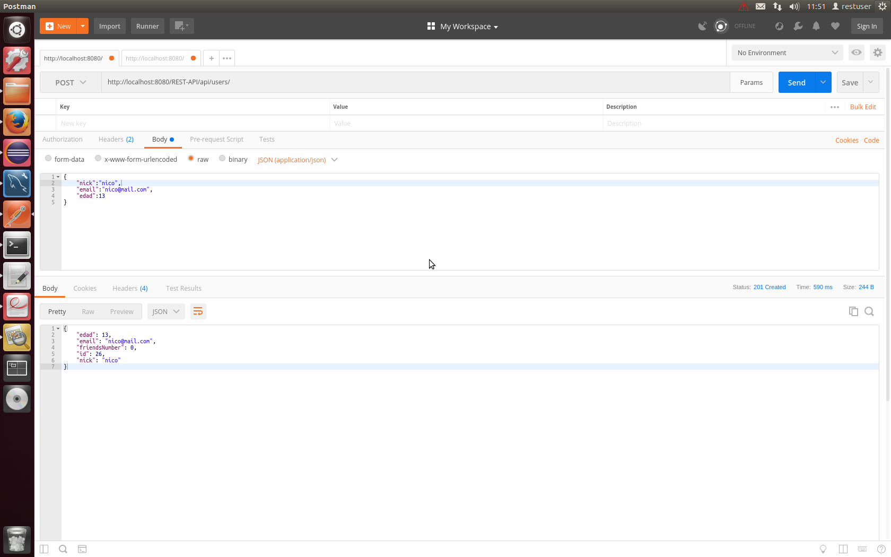
##### <span style="color: blue;font-size: 1.5em;">[GET] ~/users/{user_id}</span>
Devuelve la informacion del usuario con el user_id especificado.
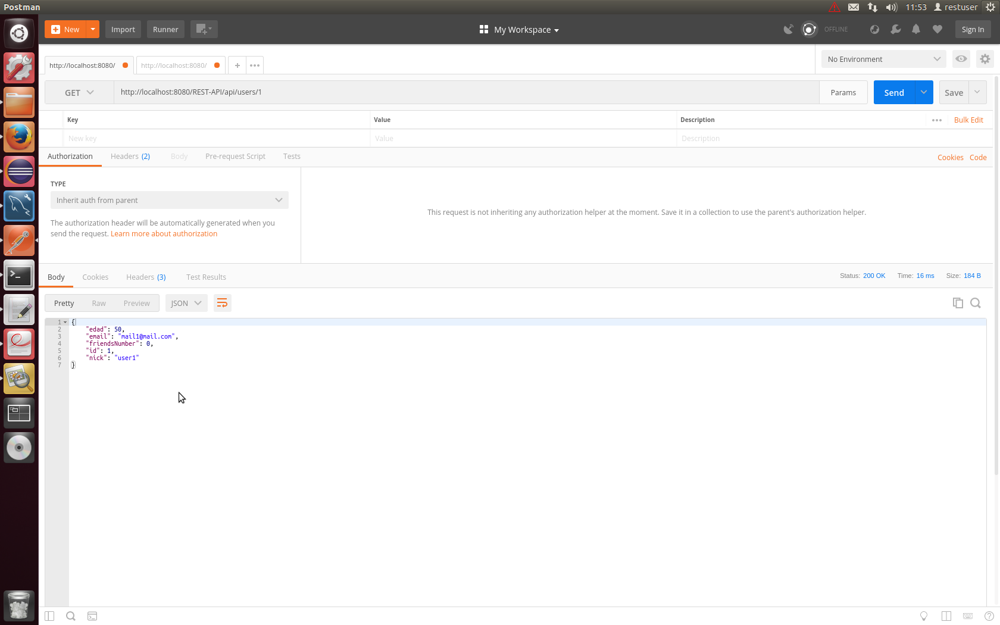
##### <span style="color: orange;font-size: 1.5em;">[PUT] ~/users/{user_id}</span>
Modifica los atributos de un usuario.

##### <span style="color: red;font-size: 1.5em;">[DELETE] ~/users/{user_id}</span>
Elimina a un usuario de la red.

##### <span style="color: blue;font-size: 1.5em;">[GET] ~/users</span>
Devuelve los usuarios de la red que contenga en su nombre el parametro user_name.
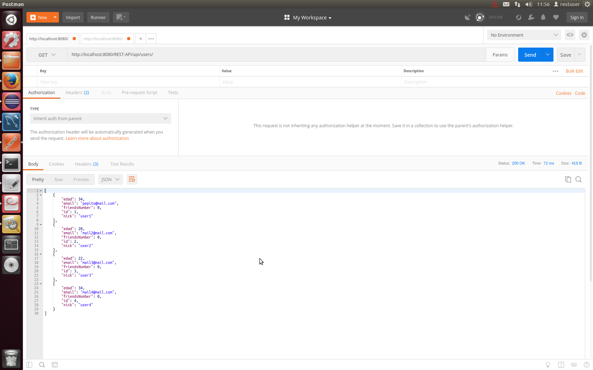
<br>

#### READ BOOKS POSTMAN

##### <span style="color: green;font-size: 1.5em;">[POST] ~/users/{user_id}</span>
Anade un libro leido por un usuario a la red.
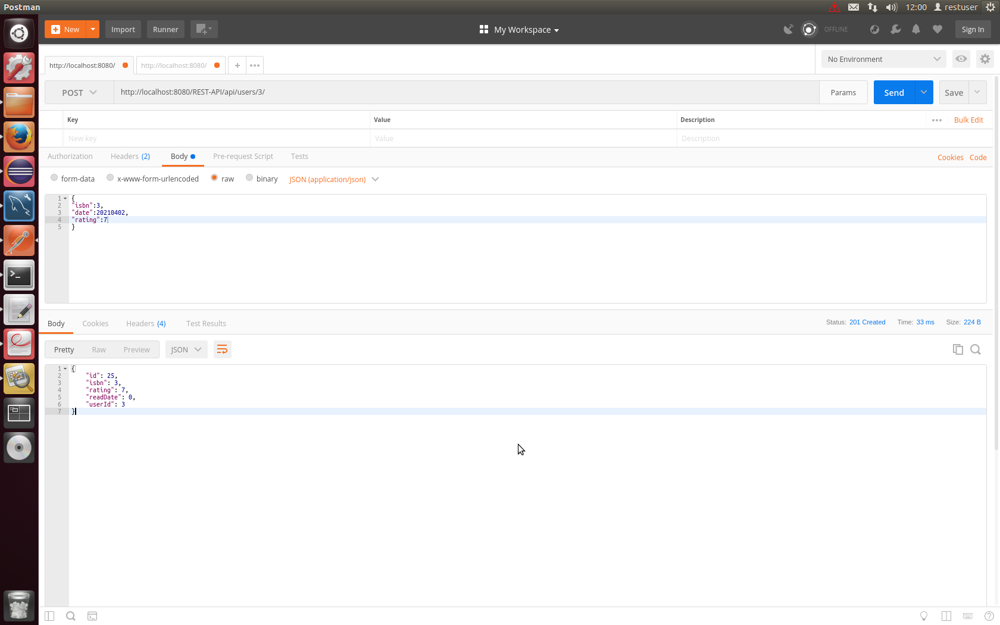
##### <span style="color: red;font-size: 1.5em;">[DELETE] ~/users/{user_id}/read_books/{isbn}</span>
Elimina la lectura de un libro por parte de un usuario.
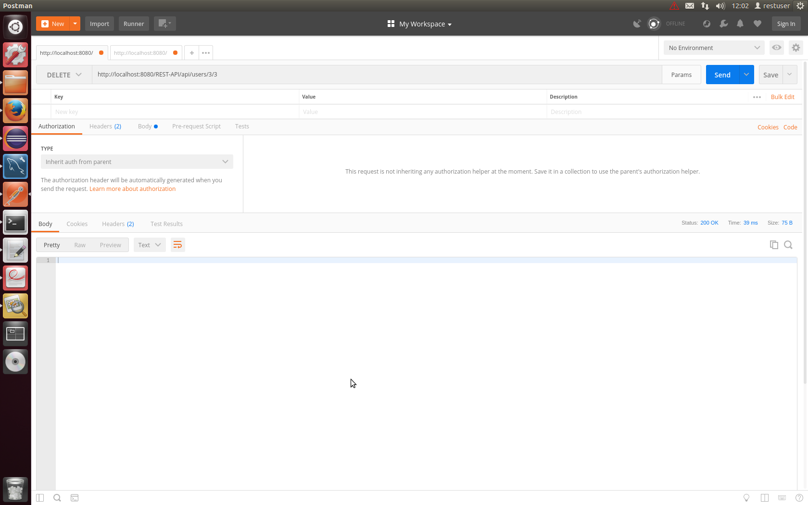
##### <span style="color: orange;font-size: 1.5em;">[PUT] ~/users/{user_id}/read_books/{isbn}</span>
Modifica los atributos de la lectura de un libro.
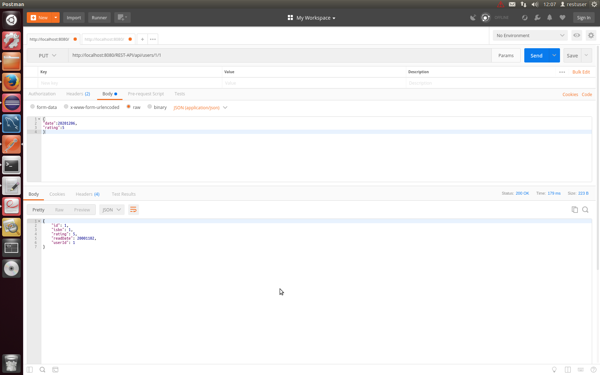
##### <span style="color: blue;font-size: 1.5em;">[GET] ~/users/{user_id}/readings</span>
Devuelve los ultimos libros leidos por un usuario en funcion de una fecha y respetando los criterios de paginacion.
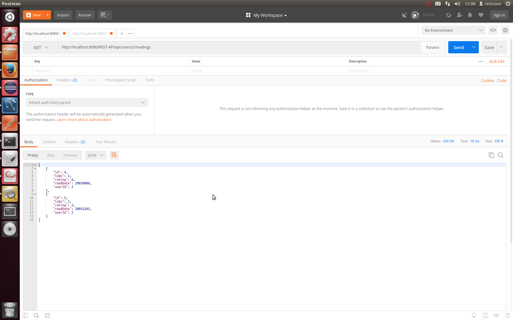
<br>

#### FRIENDS POSTMAN

##### <span style="color: green;font-size: 1.5em;">[POST] ~/users/{user_id}/friends/</span>
Crea una amistad de un usuario con otro.
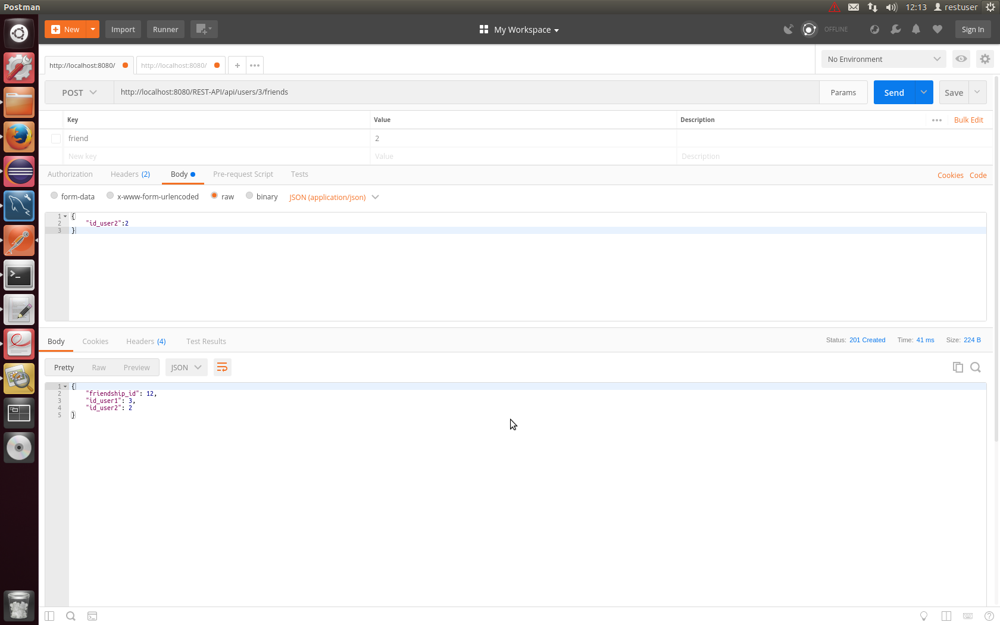
##### <span style="color: red;font-size: 1.5em;">[DELETE] ~/users/{user_id}/friends/</span>
Elimina la amistad de un usuario con otro.
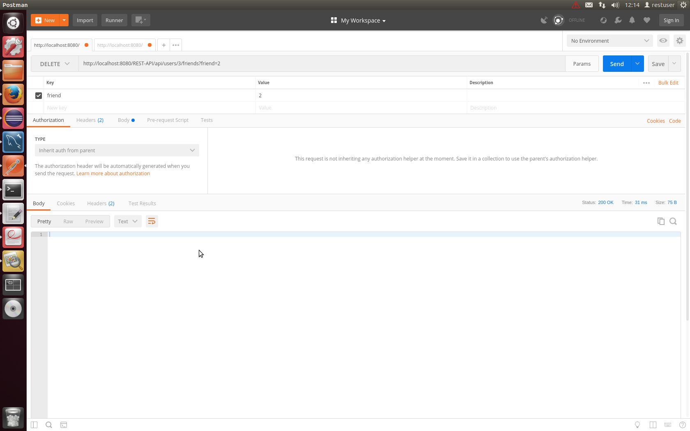
##### <span style="color: blue;font-size: 1.5em;">[GET] ~/users/{user_id}/friends</span>
Devuelve los amigos de un usuario en funcion de un parametro nombre.
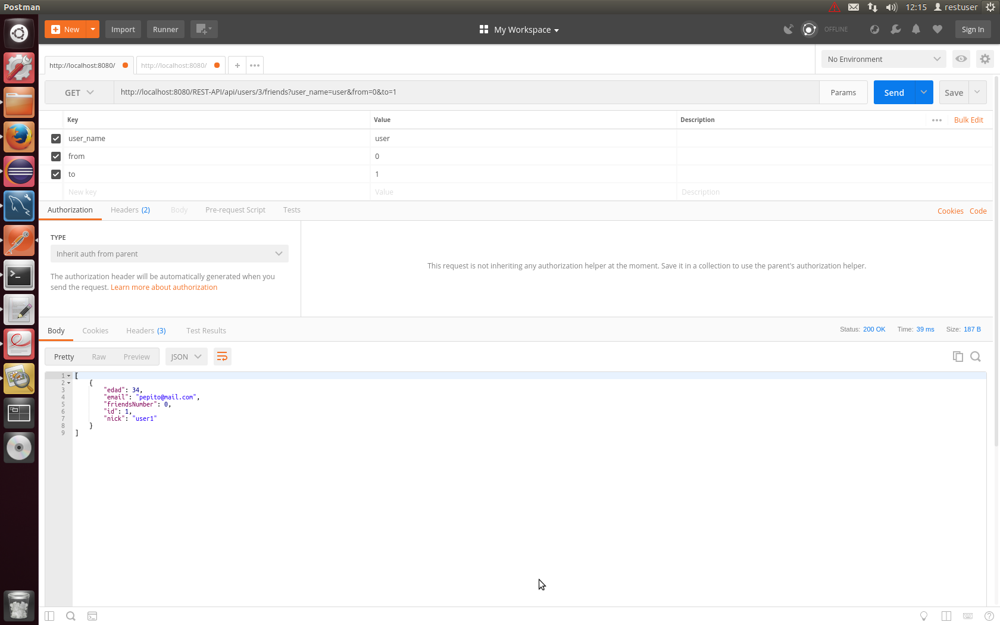
##### <span style="color: blue;font-size: 1.5em;">[GET] ~/users/{user_id}/friendsreadings</span>
Devuelve las lecturas de libros de los amigos de un usuario en funcion de la fecha de lectura.
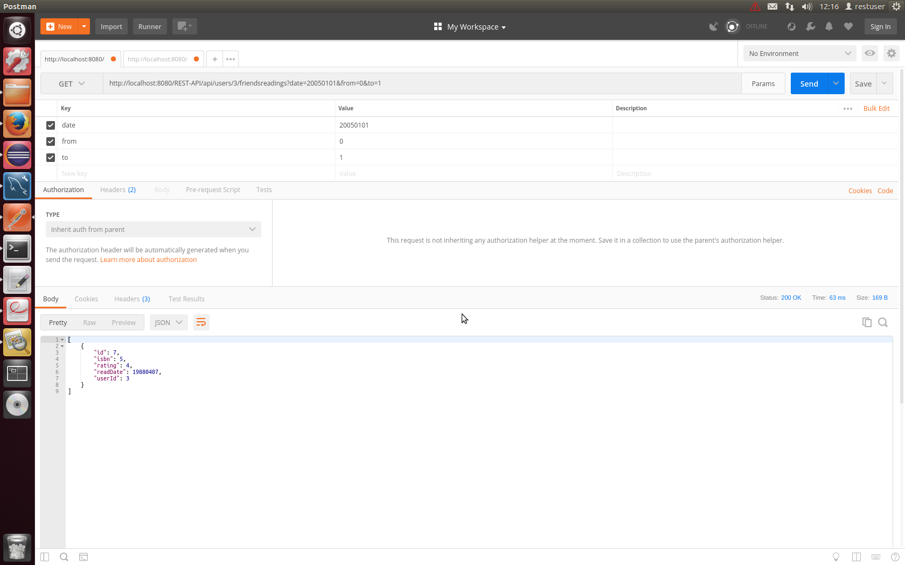
##### <span style="color: blue;font-size: 1.5em;">[GET] ~/users/{user_id}/friendsrecomendations</span>
Devuelve las recomendaciones de libros por parte de los amigos de un usuario en funcion de la fecha de lectura, el rating y el nombre del autor.

##### <span style="color: blue;font-size: 1.5em;">[GET] ~users/{user_id}</span>
Devuelve la informacion completa de un usuario, incluidos los ultimos libros leidos por sus amigos, numero de estos y el ultimo libro leido por el usuario en cuestion.
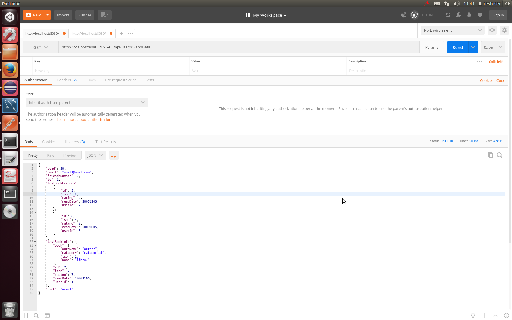

<br><br>

### Pruebas Cliente JAVA

#### USERS JAVA

##### <span style="font-size: 1.25em;">Crear un usuario</span>
``` JAVA
User u = new client.User();
u.setNick("pepe");
u.setEdad(19);
u.setEmail("pepe@mail.com");
r = target.path("api").path("users").request().accept(MediaType.APPLICATION_JSON).post(Entity.json(u),Response.class);
System.out.println("CREAR USER:"+r.getStatus());
System.out.println("Location: " + r.getHeaders().get("Location").get(0).toString());
```
CREAR USER:201
Location: http://localhost:8080/booknet/api/users/1
<br><br>

##### <span style="font-size: 1.25em;">Ver datos de un usuario</span>
``` JAVA
System.out.println("DATOS DE UN USER:"+target.path("api").path("users/1").request()
	            .accept(MediaType.APPLICATION_JSON).get(String.class));
```
DATOS DE UN USER:
{"edad":19,"email":"pepito@mail.com","friendsNumber":0,"id":1,"nick":"pepe"}
<br><br>

##### <span style="font-size: 1.25em;">Actualizar datos de un usuario</span>
``` JAVA
User u2 = new client.User();
  u2.setEdad(25);
	u2.setEmail("pepe23@mail.com");
  System.out.println("ACTUALIZAR DATOS DE UN USER:"+target.path("api").path("users/1").request()
      .accept(MediaType.APPLICATION_JSON).put(Entity.json(u2),Response.class).getStatus());
```
ACTUALIZAR DATOS DE UN USER:200
<br><br>

##### <span style="font-size: 1.25em;">Borrar usuario</span>
``` JAVA
r = target.path("api").path("users/4").request().delete();
System.out.println("BORRAR DATOS DE UN USER:"+r.getStatus());
```
BORRAR DATOS DE UN USER:200
<br><br>

##### <span style="font-size: 1.25em;">Obtener usuarios en la red</span>
``` JAVA
System.out.println("LISTADO USUARIOS:"+target.path("api").path("users/").request()
    .accept(MediaType.APPLICATION_JSON).get(String.class));
```
LISTADO USUARIOS:
[{"edad":19,"email":"pepito@mail.com","friendsNumber":0,"id":1,"nick":"pepe"},{"edad":20,"email":"mail2@mail.com","friendsNumber":0,"id":2,"nick":"user2"}]
<br><br>

##### <span style="font-size: 1.25em;">Obtener usuarios por nombre</span>
``` JAVA
System.out.println("LISTADO USERS POR NOMBRE:"+target.path("api").path("users/").queryParam("user_name", "user").request()
    .accept(MediaType.APPLICATION_JSON).get(String.class));
```
LISTADO USERS POR NOMBRE:
[{"edad":20,"email":"mail2@mail.com","friendsNumber":0,"id":2,"nick":"user2"}]
<br><br>

#### READ BOOKS JAVA

##### <span style="font-size: 1.25em;">Add lectura por parte de un usuario con calificacion</span>
``` JAVA
ReadBook readBook = new ReadBook();
readBook.setIsbn(3);
readBook.setRating(8);
readBook.setReadDate(20201102);//yyyymmdd
Response r1 = target.path("api").path("users/3").request().accept(MediaType.APPLICATION_JSON).post(Entity.json(readBook),Response.class);
System.out.println("CREAR LECTURA:"+r1.getStatus());
System.out.println("Location: " + r1.getHeaders().get("Location").get(0).toString());
```
CREAR LECTURA:201
Location: http://localhost:8080/booknet/api/users/read_books/1
<br><br>

##### <span style="font-size: 1.25em;">Eliminar lectura de un libro por parte de un usuario</span>
``` JAVA
r = target.path("api").path("users/3/3").request().delete();
	    System.out.println("BORRAR LECTURA DE USUSARIO:"+r.getStatus());
```
BORRAR LECTURA DE USUARIO:200
<br><br>

##### <span style="font-size: 1.25em;">Editar lectura de un libro por parte de un usuario</span>
``` JAVA
ReadBook readBook2 = new ReadBook();
readBook2.setRating(8);
readBook2.setReadDate(20210730);//yyyymmdd
System.out.println("ACTUALIZAR DATOS DE UNA LECTURA:"+target.path("api").path("users/1/2").request()
    .accept(MediaType.APPLICATION_JSON).put(Entity.json(readBook2),Response.class).getStatus());
```
ACTUALIZAR DATOS DE UNA LECTURA:200
<br><br>

##### <span style="font-size: 1.25em;">Consultar los libros leidos</span>
``` JAVA
System.out.println("LISTADO LIBROS:"+target.path("api").path("users/1/readings").request()
    .accept(MediaType.APPLICATION_JSON).get(String.class));
```
LISTADO LIBROS:
[{"id":4,"isbn":1,"rating":6,"readDate":20010806,"userId":2},{"id":5,"isbn":2,"rating":2,"readDate":20051203,"userId":2}]
<br><br>

##### <span style="font-size: 1.25em;">Consultar los libros leidos antes de cierta fecha</span>
``` JAVA
System.out.println("LISTADO LIBROS LIMITE FECHA:"+target.path("api").path("users/1/readings").queryParam("date",20210101).request()
    .accept(MediaType.APPLICATION_JSON).get(String.class));
```
LISTADO LIBROS LIMITE FECHA:
[{"id":4,"isbn":1,"rating":6,"readDate":20010806,"userId":2}]
<br><br>

##### <span style="font-size: 1.25em;">Consultar los libros leidos antes de cierta fecha y con paginacion especifica</span>
``` JAVA
System.out.println("LISTADO LIBROS LIMITE FECHA Y CANTIDAD:"+target.path("api").path("users/1/readings").queryParam("date",20210101).queryParam("from",1).queryParam("to",2).request()
    .accept(MediaType.APPLICATION_JSON).get(String.class));
```
> **Nota:**
> Al haber limitado las posiciones de 1 a 2, el resultado es el mismo que en el apartadp anterior.

LISTADO LIBROS LIMITE FECHA Y CANTIDAD:
[{"id":4,"isbn":1,"rating":6,"readDate":20010806,"userId":2}]
<br><br>

#### FRIENDS JAVA

##### <span style="font-size: 1.25em;">Add amigo</span>
``` JAVA
Friendship f = new client.Friendship();
f.setId_user2(2);
r = target.path("api").path("users/3/friends").request().accept(MediaType.APPLICATION_JSON).post(Entity.json(f),Response.class);
System.out.println("ANADIR AMIGO:"+r.getStatus());
System.out.println("Location: " + r.getHeaders().get("Location").get(0).toString());
```
ANADIR AMIGO:2001
Location: http://localhost:8080/booknet/api/users/3/friends/12
<br><br>

##### <span style="font-size: 1.25em;">Borrar amistad</span>
``` JAVA
r = target.path("api").path("users/3/friends").queryParam("friend",1).request().accept(MediaType.APPLICATION_JSON).delete();
System.out.println("BORRAR DATOS DE UN USER:"+r.getStatus());
```
BORRAR DATOS DE UN USER:200
<br><br>

##### <span style="font-size: 1.25em;">Consultar amigos</span>
``` JAVA
System.out.println("LISTADO AMIGOS:"+target.path("api").path("users/1/friends").request()
    .accept(MediaType.APPLICATION_JSON).get(String.class));
```
LISTADO AMIGOS:
[{"edad":34,"email":"pepito@mail.com","friendsNumber":0,"id":1,"nick":"user1"}]
<br><br>

##### <span style="font-size: 1.25em;">Consultar amigos con cierto patron de nombre</span>
``` JAVA
System.out.println("LISTADO AMIGOS LIMITE NOMBRE:"+target.path("api").path("users/1/friends").queryParam("friend_name","user2").request()
    .accept(MediaType.APPLICATION_JSON).get(String.class));
```
> **Nota:**
> Su unico amigo tiene nombre user1 y al introducir el filtro friend_name = user2, no encuentra ningun amigo que satisface la condicion
LISTADO DE AMIGOS LIMITE NOMBRE:
[]
<br><br>

##### <span style="font-size: 1.25em;">Consultar amigos con cierto patron de nombre y paginacion especifica</span>
``` JAVA
System.out.println("LISTADO AMIGOS LIMITE NOMBRE Y CANTIDAD:"+target.path("api").path("users/1/friends").queryParam("friend_name","user").queryParam("from",1).queryParam("to",2).request()
    .accept(MediaType.APPLICATION_JSON).get(String.class));
```
LISTADO AMIGOS LIMITE NOMBRE Y CANTIDAD:
[{"edad":34,"email":"pepito@mail.com","friendsNumber":0,"id":1,"nick":"user1"}]
<br><br>

##### <span style="font-size: 1.25em;">Consultar libros leidos por amigos</span>
``` JAVA
System.out.println("LISTADO LIBROS AMIGOS:"+target.path("api").path("users/1/friendsreadings").request()
    .accept(MediaType.APPLICATION_JSON).get(String.class));
```
LISTADO LIBROS AMIGOS:
[{"id":7,"isbn":5,"rating":4,"readDate":19880407,"userId":3}]
<br><br>

##### <span style="font-size: 1.25em;">Consultar libros leidos por amigos previos a una fecha</span>
``` JAVA
System.out.println("LISTADO LIBROS AMIGOS LIMITE FECHA:"+target.path("api").path("users/1/friendsreadings").queryParam("date",20201202).request()
    .accept(MediaType.APPLICATION_JSON).get(String.class));
```
LISTADO LIBROS AMIGOS LIMITE FECHA:
[{"id":7,"isbn":5,"rating":4,"readDate":19880407,"userId":3}]
<br><br>

##### <span style="font-size: 1.25em;">Consultar libros leidos por amigos previos a una fecha y con paginacion especifica</span>
``` JAVA
System.out.println("LISTADO LIBROS AMIGOS LIMITE FECHA Y CANTIDAD:"+target.path("api").path("users/1/friendsreadings").queryParam("date",20200102).queryParam("from",1).queryParam("to",2).request()
    .accept(MediaType.APPLICATION_JSON).get(String.class));
```
LISTADO LIBROS AMIGOS LIMITE FECHA Y CANTIDAD:
[{"id":7,"isbn":5,"rating":4,"readDate":19880407,"userId":3}]
<br><br>

##### <span style="font-size: 1.25em;">Consultar libros leidos recomendados</span>
``` JAVA
System.out.println("LISTADO LIBROS RATING:"+target.path("api").path("users/1/friendsrecomendations").queryParam("rating",4).request()
    .accept(MediaType.APPLICATION_JSON).get(String.class));
```
LISTADO LIBROS RATING:
[{"authName":"autor1","category":"categoria1","isbn":1,"name":"libro1"}]
<br><br>

##### <span style="font-size: 1.25em;">Consultar libros leidos recomendados filtrados por rating y autor</span>
``` JAVA
System.out.println("LISTADO LIBROS RATING LIMITE AUTOR:"+target.path("api").path("users/1/friendsrecomendations").queryParam("rating",2).queryParam("author","autor2").request()
    .accept(MediaType.APPLICATION_JSON).get(String.class));
```
LISTADO LIBROS RATING LIMITE AUTOR:
[{"id":7,"isbn":5,"rating":4,"readDate":19880407,"userId":3}]
<br><br>

##### <span style="font-size: 1.25em;">Consultar libros leidos recomendados filtrados por categoria y autor</span>
``` JAVA
System.out.println("LISTADO LIBROS AMIGOS LIMITE AUTOR Y CATEGORIA:"+target.path("api").path("users/1/friendsrecomendations").queryParam("rating",4).queryParam("author","autor").queryParam("category","categoria1").request()
.accept(MediaType.APPLICATION_JSON).get(String.class));
```
LISTADO LIBROS AMIGOS LIMITE AUTOR Y CATEGORIA:
[{"id":7,"isbn":5,"rating":4,"readDate":19880407,"userId":3}]
<br><br>

##### <span style="font-size: 1.25em;">Consultar datos completod de un usuario por la aplicacion movil</span>
``` JAVA
System.out.println("LISTADO APPDATA:"+target.path("api").path("users/1/appData").request()
    .accept(MediaType.APPLICATION_JSON).get(String.class));
```
LISTADO APPDATA:
{"edad":50,"email":"mail1@mail.com","friendsNumber":2,"id":1,"lastBookFriends":[{"id":5,"isbn":2,"rating":2,"readDate":20051203,"userId":2},{"id":6,"isbn":4,"rating":8,"readDate":20091005,"userId":3}],"lastBookInfo":{"book":{"authName":"autor2","category":"categoria1","isbn":2,"name":"libro2"},"id":2,"isbn":2,"rating":7,"readDate":20001106,"userId":1},"nick":"user1"}

